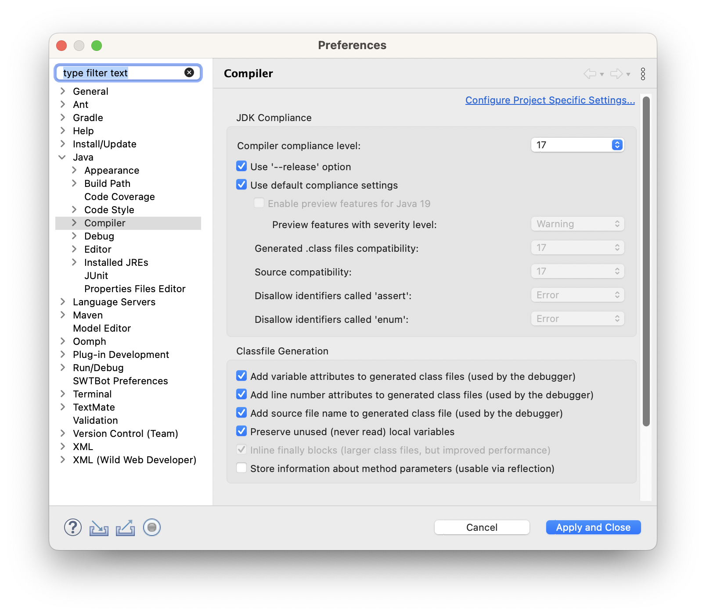
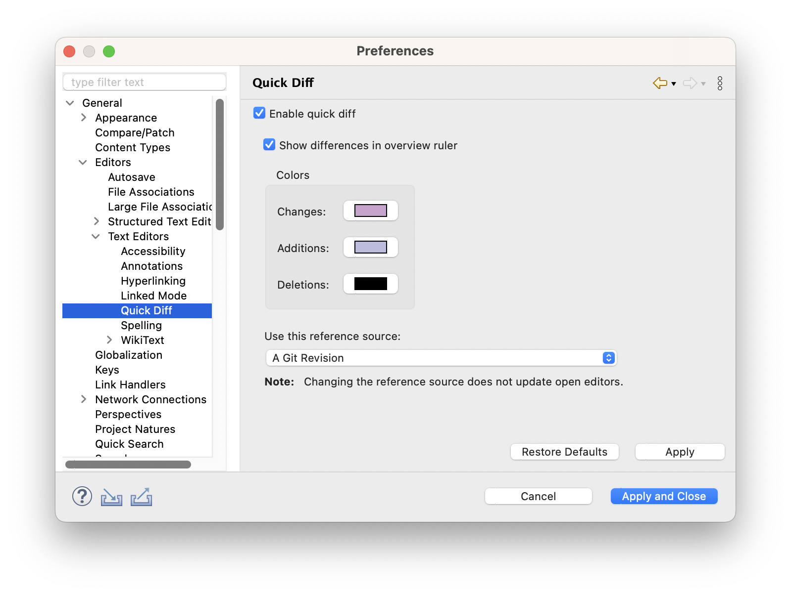
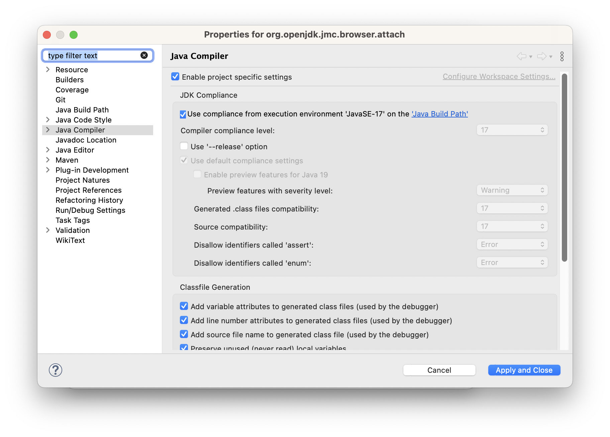
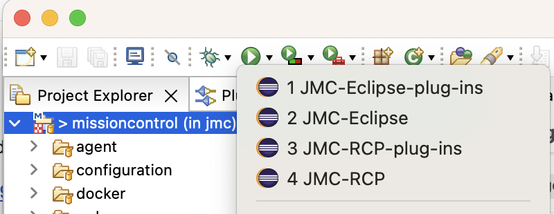

# Developing JDK Mission Control

This document explains how to get started developing JDK Mission Control in Eclipse.

## Getting Eclipse

First of all you should download the latest version of Eclipse. JMC is an RCP application, and thus, the easiest way to make changes to it, is to use the Eclipse IDE.

There are various Eclipse bundles out there. Get (at least) the Eclipse IDE for Eclipse Committers. It adds some useful things, like PDE (the Plugin Development Environment), Git, the Marketplace client and more. You can also use the Eclipse IDE for Java Enterprise Developers.

**You will need an Eclipse 2022-09 or later!**

To get to the screen where you can select another packaging than the standard, click on the [Download Packages](https://www.eclipse.org/downloads/eclipse-packages) link on the Eclipse download page.

Install Eclipse, and before starting it, add the following two lines to the eclipse.ini file:
   ```
   -Dp2.httpRule=allow
   -Dp2.trustedAuthorities=https://download.eclipse.org,https://archive.eclipse.org,http://localhost
   ```

Alternatively, instead of editing the eclipse.ini file you can update the `http` Protocol Rule found in _Preferences > Install/Update > Trust > Authorities > Protocol Rules_ from `Default` to `Allow`.

**As of Eclipse 2023-06 and above** Eclipse made all access to external update sites and their artifacts use https, even when http is specified. The local p2 repository served by Jetty is currently configured as http, so this step is necessary in order to resolve the Platform Target as described later in the _Setting up the PDE target runtime environment_ section.

Next start Eclipse and create a new workspace for your JMC work. Creating a new workspace is as easy as picking a new name when starting up your Eclipse in the dialog asking for a directory for the workspace:


## Setting up the JDK

Next set up a JDK in your Eclipse. Download and install your favourite JDK 17 distribution, then open _Window | Preferences_, select _Java / Installed JREs_ and add it in the dialog (_Add…_).


Then go to _Java / Installed JREs / Execution Environments_ and select your JDK17 as the JDK for the JavaSE-17 execution environment.


Ensure Eclipse compiler is set to Java 17. For that, go to _Preferences | Java / Compiler_, then for _Compiler compliance level_ choose `17`.



### Setting up the PDE target runtime environment

Start the Jetty server as described in the [build instructions](../../README.md#building-mission-control-from-source):

   ```
   mvn p2:site --file releng/third-party/pom.xml; mvn jetty:run --file releng/third-party/pom.xml
   ```

   


When it is running, go ahead and open up the most recent target file you can find, available under `releng/platform-definitions/platform-definition-{year}-{month}` (__File | Open File__). You should see something like this:


**Wait for all the dependencies to be properly loaded** (check the progress in the lower right corner), then click the _Set as Active Target Platform_ link in the upper right corner.

## Configuring Eclipse

**Maven settings**

Now there is one final preparation for the import – we need to turn off certain Maven settings. Go to the preferences, and select _Maven / Errors/Warnings_. Set _Plugin execution not covered by lifecycle configuration_ to _Ignore_, and also _Out-of-date project configuration_ to _Ignore_.


**Optional: Show diff against git**

By default Eclipse uses the version on disk. It may be practical to use instead the git version. Open _Window | Preferences_ then _General | Editors | Text Editors | Quick Diff_. Select _Git Revision for the reference source.



Now the preparations are done, and we can start importing the projects. Woho!

## Importing the Projects

First we will have to import the `core/` projects, since they are built separately from the rest. Select _File | Import…_ and select _Maven / Existing Maven Project_.


Click next, and browse into the `jmc/core` folder. Select all the core projects and import them.

Next select _File | Import…_ and select _Maven / Existing Maven Project_ again, but this time from the repository root (`jmc`).

The projects will likely have build errors because the `org.openjdk.jmc.browser.attach` project requires JDK internal module exports and this is not compatible with the `--release` Java compiler option (which only tracks public symbols).
There is an [open issue at Eclipse M2E](https://github.com/eclipse-m2e/m2e-core/issues/1375) currently but until this is solved, you have to manually fix this. To do so, right click on the `org.openjdk.jmc.browser.attach` project, select _Properties_, then go to _Java Compiler_, and untick `Use '--release' option`.



Eclipse should propose a rebuild. After that's done, the errors should be gone.

**Launchers**

After importing the projects, Eclipse should also have launchers.



<details><summary>Optional: Import launcher project</summary>

For developing/modifying the launchers, you can also import the according project. Select _File | Import…_ and then select _Existing Projects into Workspace_. Find the `configuration/ide/eclipse` folder and click Ok.


</details>

After importing the projects, we can now launch / debug JMC from within Eclipse:


## Configuring Development Settings

If you don’t plan on submitting any changes, then this step is optional. The team uses shared settings for formatter and macros. Go to the preferences and then to _Java / Code Style / Formatter_. Then click _Import…_ and select the `configuration/ide/eclipse/formatting/formatting.xml`. You should now have the _Mission Control_ formatting settings active:


Optional:

If you have the spotbugs plug-in installed, you should also import the spotbugs excludes (`configuration/spotbugs/spotbugs-exclude.xml`). There is also a common dictionary (`configuration/ide/eclipse/dictionary/dictionary.txt`) and templates (`configuration/ide/eclipse/templates/JMC templates.xml`) which you may find useful.

For dynamic working sets, see http://hirt.se/blog/?p=1149.

For testing: Run all tests as "JUnit Plugin-In Test" tests in eclipse and use the scripts in the `scripts` folder for running the tests. Run the class `org.openjdk.jmc.rjmx.test.testutil.JVMKeepAlive` with the VM arguments `-Dcom.sun.management.jmxremote.port=7091 -Dcom.sun.management.jmxremote.authenticate=false -Dcom.sun.management.jmxremote.ssl=false` alongside.
