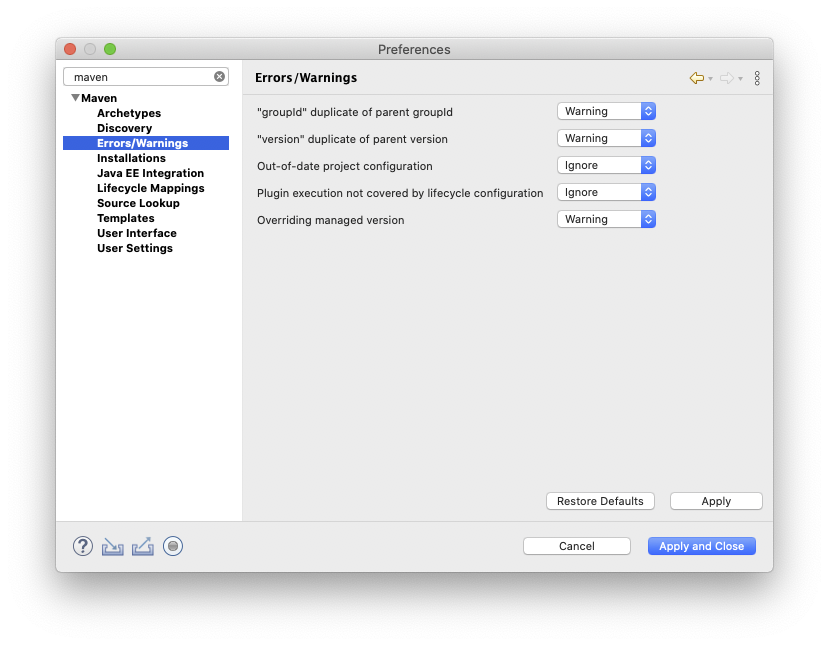
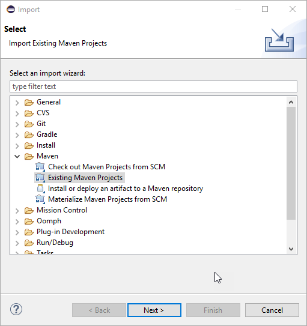

# Developing JDK Mission Control
This document explains how to get started developing JDK Mission Control in Eclipse.

## Getting Eclipse
First of all you should download the latest version of Eclipse. JMC is an RCP application, and thus, the easiest way to make changes to it, is to use the Eclipse IDE.

There are various Eclipse bundles out there. Get (at least) the Eclipse IDE for Eclipse Committers. It adds some useful things, like PDE (the Plugin Development Environment), Git, the Marketplace client and more. You can also use the Eclipse IDE for Java Enterprise Developers.

**You will need an Eclipse 2020-03 or later!**

To get to the screen where you can select another packaging than the standard, click on the [Download Packages](https://www.eclipse.org/downloads/eclipse-packages) link on the Eclipse download page.

Install it, start it and create a new workspace for your JMC work. Creating a new workspace is as easy as picking a new name when starting up your Eclipse in the dialog asking for a directory for the workspace:

## Installing JDKs
If you haven't already, you should now first build JMC using the instructions in the [README.md](../../README.md). 

Next set up your JDKs in your Eclipse. Download and install a JDK 8 and JDK 11 (or the very latest update of the latest JDK), then open Window | Preferences and then select Java / Installed JREs. Add your favourite JKD 8 and JDK 11 JDKs (Add…) and then use Java / Installed JREs / Execution Environments to set them as defaults for the JDK 8 and JDK 11 execution environments.

Setting installed JREs:

Setting execution environments:

Okay, we now have our JDKs set up. If you want to import not only the JMC core project, you will next need to set up a user library for things that JMC will need from the JDK. Go to Preferences | Java/Build Path/User Libraries and create a new library named JMC_JDK. Add (Add External JARs…) the following JARs from a JDK 8 (u40 or above) to the User Library: tools.jar (/lib/tools.jar) and finally jconsole.jar (/lib/jconsole.jar).

Creating the user library:

Adding the jars:

Now we need to check a few things…

### Checkpoint
* Is the Jetty server from the build instructions still up and running? 

If yes, go ahead and open up the most recent target file you can find, available under releng/platform-definitions/platform-definition-&lt;year&gt;-&lt;month&gt; (File | Open File). You should see something like this:

Wait for all the dependencies to be properly loaded (check the progress in the lower right corner), then click the Set as Active Target Platform link in the upper right corner.

Now there is one final preparation for the import – we need to turn off certain Maven settings. Go to the preferences, and select Maven / Errors/Warnings. Set Plugin execution not covered by lifecycle configuration to Ignore, and also Out-of-date project configuration to Ignore

Now the preparations are done, and we can start importing the projects. Woho!

## Importing the Projects
First we will have to import the core projects, since they are built separately from the rest. Select File | Import… and select Maven / Existing Maven Project.

Click next, and browse into the jmc/core folder. Select all the core projects and import them.

Next select File | Import… and select Maven / Existing Maven Project again, but this time from the root.

Next we will import the project which contains the launchers. Select File | Import… and then select Existing Projects into Workspace. Find the configuration/ide/eclipse folder and click Ok.

After importing that project, we can now launch / debug JMC from within Eclipse:

## Configuring Development Settings
If you don’t plan on submitting any changes, then this step is optional. The team use shared settings for formatter and macros. Go to the preferences and then to Java / Code Style / Formatter. Then click Import… and select the configuration/ide/eclipse/formatting/formatting.xml. You should now have the Mission Control formatting settings active:

Optional:

If you have the spotbugs plug-in installed, you should also import the spotbugs excludes (configuration/spotbugs/spotbugs-exclude.xml). There is also a common dictionary (configuration/ide/eclipse/dictionary/dictionary.txt) and templates (configuration/ide/eclipse/templates/JMC templates.xml) which you may find useful.

For dynamic working sets, see http://hirt.se/blog/?p=1149.